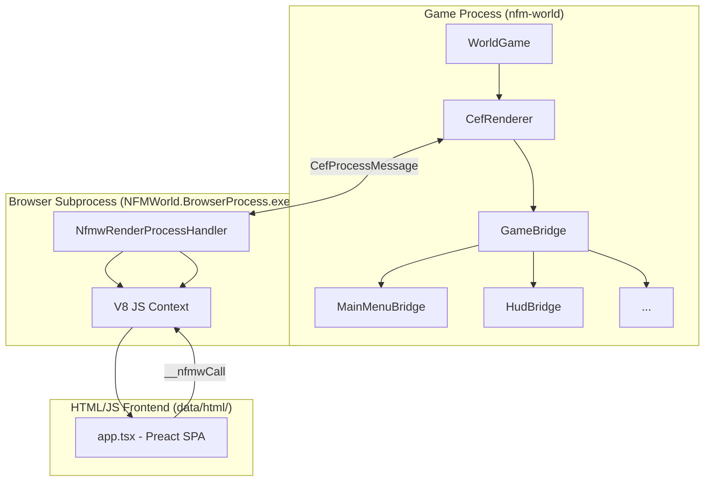

# Agent instructions — NFM-World

Keep guidance short and actionable. Reference files and patterns below when making changes.

DO NOT write PowerShell or shell scripts for code-editing tasks. ALWAYS use the code-editing tools available to you.

NFM World is a custom game engine and game written primarily in **C#**, targeting `net10.0`. The playable app lives in `nfm-world/` (`NFMWorld.csproj`) and depends on many sibling projects — notably `NFMWorld.Library`, `FNA.Core` (via NvgSharp), and `MonoGame.ImGuiNet`. Treat `nfm-world/` as the app entry point; engine/framework code is in `FNA/`; rendering and GUI glue is under `NvgSharp/`, `FontStashSharp/`, and `MonoGame.ImGuiNet/` (FontStashSharp is in the solution but not a direct ProjectReference of the app).

- **Big picture:** The playable app lives in `nfm-world/` (`NFMWorld.csproj`) and depends on many sibling projects (notably `NFMWorld.Library`, `NvgSharp.FNA.Core`, `NvgSharp.Text.FNA.Core`, `MonoGame.ImGuiNet`). Treat `nfm-world` as the app entry; engine/framework code is in `FNA/` and rendering/GUI glue under `NvgSharp/`, `FontStashSharp/`, and `MonoGame.ImGuiNet/`.

Key characteristics:
- **CEF-based UI** — the UI is a Preact + TypeScript SPA rendered by CEF (Chromium Embedded Framework) as a transparent overlay. Replaces both the legacy XAML and Reactor VDOM systems.
- A custom **shader pipeline**: shaders in `data/shaders/*.fx` are compiled to `.fxb` via `fxc.exe` during build.
- **Fixed-point math** (`FixedMathSharp`) for deterministic physics and gameplay logic.
- A **virtual file system** (`Maxine.VFS`) with path abstraction over real and in-memory backends.
- A Blender-based asset pipeline using the proprietary **RAD 3D** car format.

- **Build / run:** Use the .NET SDK (this repo targets `net10.0`). Typical commands:
  - Build entire workspace: `dotnet build nfm-world.slnx -c Debug`
  - Build single project: `dotnet build nfm-world/NFMWorld.csproj`
  - Run: `dotnet run --project nfm-world/NFMWorld.csproj`
  - Run tests: `dotnet test --no-build` from solution root or test project folder.

- **Shaders & tools:** Shaders in `data/shaders/*.fx` are compiled to `.fxb` via `fxc.exe` during build (`BuildShaders` target). On non-Windows builds the project expects `wine` + a Windows DirectX SDK `fxc.exe` (winetricks `dxsdk_jun2010`) or a `tools/fxc.exe` helper. If altering shader handling, preserve the MSBuild targets in `nfm-world/NFMWorld.csproj` that produce and include `.fxb` files.

- **Platform nuances:**
  - The project sets `AllowUnsafeBlocks` and several compile symbols (e.g. `USE_BASS`). Keep those when editing compilation logic.

- **Project patterns / conventions:**
  - Most subprojects are referenced with `ProjectReference` from `NFMWorld.csproj`; prefer keeping cross-project ref changes small and use `dotnet sln` only when adding/removing whole projects.
  - Game logic vs UI: `NFMWorld.Library` contains backend/game systems; UI, rendering and native interops live in `nfm-world/`, `NvgSharp/`, and `FNA/`. The CEF-based UI lives in `nfm-world/UI/Cef/` (C# integration) and `data/html/` (Preact SPA frontend).
  - **CefGlue.BrowserProcess** and **NFMWorld.BrowserProcess** are the CEF subprocess hosts. `NFMWorld.BrowserProcess` extends the generic `CefGlue.BrowserProcess` with NFM-specific render process handling and V8 JS interop.
  - Data and assets: NFMWorld and NFMWorld.Library include `None Include="data\**\*" CopyToOutputDirectory=...` — follow existing CopyToOutputDirectory semantics rather than inventing new asset pipelines.

- **Dependencies & runtime notes:**
  - NuGet packages used by the app include `ImGui.NET`, `ManagedBass` (and related). When adding packages, prefer matching versions already in the csproj.
  - For local developer builds on Linux/macOS, ensure native dependencies (OpenGL drivers, libSDL, wine for shader compilation) are present.

- **Tests and CI hints:**
  - Run `dotnet test` at repo root; test projects are co-located with their libraries (e.g. `HoleyDiver.UnitTest`).
  - CI should `dotnet restore` then `dotnet build` then `dotnet test`. If CI runs on Linux/macOS, ensure native copy targets won't fail due to missing platform files — add conditional guards or include stub files as needed.

- **When editing MSBuild targets:** Inspect `nfm-world/NFMWorld.csproj` for patterns: shader compilation targets, copy-to-output items, and platform-specific Publish hooks. Changes here affect runtime asset layout; run a local `dotnet publish` to validate.

- **Where to look for behavior:**
  - Initialization / main loop: `nfm-world/NFMWorld.csproj` → `WorldGame.cs`, `NFMWorld.csproj` references `WorldGame.cs` as a logical entry point.
  - CEF UI integration: `nfm-world/UI/Cef/CefRenderer.cs` (central orchestrator), `nfm-world/UI/Cef/GameBridge.cs` (JS↔C# messaging), `nfm-world/UI/Cef/Bridges/` (per-phase bridges).
  - CEF subprocess: `NFMWorld.BrowserProcess/` and `CefGlue.BrowserProcess/` (renderer process host, V8 interop).
  - Frontend SPA: `data/html/src/` (Preact + TypeScript + Vite).
  - Game backend: [NFMWorld.Library](../NFMWorld.Library/NFMWorld.Library.csproj)
  - Rendering and fonts: `NvgSharp/`, `FontStashSharp/` and `FNA/`.

- **Examples to follow:**
  - Adding native files: put in the right location under NFMWorld.NativeLibs to load via the DllImport resolver.
  - Adding compiled assets (shaders): add `.fx` to `CompileShader` ItemGroup so builders include shader compilation automatically.

- **Do NOT:**
  - Remove or flatten the MSBuild platform conditionals without testing on all OSes.
  - Change shader/tool expectations without keeping a non-Windows fallback path (`tools/fxc.exe` or documented wine steps).


If anything above is unclear or you want examples inserted for a specific task (adding a native plugin, publishing for Linux, or modifying shader flow), tell me which area to expand and I will update this file.

---

## Build, Run & CI

```bash
# Build entire solution
dotnet build nfm-world.slnx -c Debug

# Build single project
dotnet build nfm-world/NFMWorld.csproj

# Run
dotnet run --project nfm-world/NFMWorld.csproj

# Run all tests
dotnet test --no-build          # from solution root
dotnet test                     # from individual test project folder
```

**CI pipeline:** `dotnet restore` → `dotnet build` → `dotnet test`. On Linux/macOS, add conditional guards to ensure platform-specific MSBuild copy targets don't fail for missing Windows-only native files.

### Shaders

Shaders in `data/shaders/*.fx` are compiled to `.fxb` by the `BuildShaders` MSBuild target via `fxc.exe`. On non-Windows:
- Use `wine` + a Windows DirectX SDK `fxc.exe` (via `winetricks dxsdk_jun2010`), **or**
- Provide a `tools/fxc.exe` helper shim.

To add a new shader, add the `.fx` source to the `<CompileShader>` ItemGroup in `NFMWorld.csproj`. Do not manually copy `.fxb` files.

### Frontend (CEF UI) build

```bash
# Build the Preact SPA frontend
cd nfm-world/data/html
pnpm install
pnpm build        # → outputs to data/html/dist/
pnpm dev          # Vite dev server on port 5173 (use with NFMW_VITE_DEV=1)
```

The built output in `data/html/dist/` is served by `NfmwSchemeHandlerFactory` via the `nfmw://` custom scheme. In dev mode (`NFMW_VITE_DEV=1` env var or `.vite-dev` marker file), the game loads from `http://localhost:5173/` instead.

### Source generator output (Reactor, legacy)

```bash
# Force regeneration of all source-generated files
Remove-Item -Recurse nfm-world/Generated
dotnet build nfm-world/NFMWorld.csproj
```

Generated files appear in `nfm-world/Generated/NFMWorld.Reactor.Generator/.../*.g.cs`. The csproj must have `<Compile Remove="Generated/**" />` to prevent double-compilation.

**Note:** The Reactor VDOM framework is being phased out in favor of the CEF-based UI. New UI work should use the CEF/Preact frontend.

---

## CEF-Based UI System

The UI is a **Preact + TypeScript SPA** rendered by CEF (Chromium Embedded Framework) as a transparent overlay on the FNA/MonoGame 3D scene. Replaces both the legacy XAML and Reactor VDOM systems.

### Key projects

| Project | Role |
|---|---|
| `CefGlue.BrowserProcess` | **Generic** CEF subprocess host — `RenderProcessHandler`, V8 JS execution, native object binding. Not NFM-specific. |
| `NFMWorld.BrowserProcess` | **NFM-specific** CEF subprocess host — extends `CefGlue.BrowserProcess` with `NfmwRenderProcessHandler` (injects `__nfmwCall` V8 global) and `nfmwPush` message handling. |
| `nfm-world/UI/Cef/` | Main game CEF integration — `CefRenderer`, `GameBridge`, `NfmwCefClient`, `NfmwCefRenderHandler`, per-phase bridges. |
| `data/html/` | Frontend SPA — Preact + TypeScript + Vite + Goober CSS-in-JS. |
| `data/html/dist/` | Built frontend output (not in repo). Served by `NfmwSchemeHandlerFactory` via `nfmw://` scheme. |

### Architecture overview



### Initialization flow

1. `CefRenderer` is constructed with `ResolveBasePageUrl()`:
   - Dev mode (`NFMW_VITE_DEV=1` or `.vite-dev`): `http://localhost:5173/`
   - Production: `nfmw://app/index.html`
2. `CefRuntime.Load()` → creates windowless, transparent CEF browser.
3. `BrowserSubprocessPath` set to `NFMWorld.BrowserProcess.exe`.
4. Registers the `nfmw://` custom scheme handler (serves `data/html/dist/` with SPA fallback).
5. Per-frame: `CefRenderer.Update(gameTime)` pumps CEF messages + forwards input; `CefRenderer.Render()` draws browser `Texture2D` as full-screen overlay.

### C# ↔ JavaScript communication

**JS → C#** (`__nfmwCall` → `CefProcessMessage` → `GameBridge`):
```
JS: __nfmwCall("methodName", jsonPayload)
  → CefProcessMessage "nfmwCall" (renderer → browser)
  → GameBridge.HandleNfmwCall()
  → dispatches to registered PhaseBridge.OnMessage(type, JsonElement?)
```
Wrap with `callNfmw(method, payload)` from `bridge.ts`.

**C# → JS** (`nfmwPush` → `CefProcessMessage` → `__nfmwDispatch`):
```
C#: PhaseBridge.Push("eventType", data) or PushMemoryPack("eventType", data)
  → GameBridge.PushToJs(browser, phaseId, eventType, data)
  → CefProcessMessage "nfmwPush" (browser → renderer)
  → V8: __nfmwDispatch("{phaseId}:{eventType}", data)
  → bridge.ts: nfmwEvents.emit(event, JSON.parse(data))
```
Supports JSON, binary (byte[] → ArrayBuffer), and MemoryPack payloads.

**C# → JS (evaluation):** `CefRenderer.ExecuteJavaScript(code)` sends arbitrary JS for execution in the V8 context.

### Per-phase bridge pattern

Each game phase has a `PhaseBridge` subclass:

| Bridge | Phase ID | Role |
|---|---|---|
| `DummyBridge` | `"empty"` | Default no-op |
| `MainMenuBridge` | `"main-menu"` | Navigation + account state |
| `HudBridge` | `"race"` | Race telemetry (speed, lap, damage, position) |
| `GarageBridge` | `"garage"` | Car selection/upgrades |
| `SettingsBridge` | `"settings"` | Game settings |

**Bridge lifecycle (from `BasePhase`):**
1. Phase.Enter → `CefBridge?.Register(CefRenderer)` → registers message handler + navigates to hash URL
2. Each frame EndGameTick → `CefBridge?.PushCefState()` pushes state to JS
3. Phase.Exit → `CefBridge?.Unregister()` → unregisters handler

Hash-based navigation across a single browser instance: `ExecuteJavaScript("window.location.href = '#/race';")`.

### Frontend (Preact SPA)

**Tech stack:** Preact (~3KB) + Vite + Goober (CSS-in-JS, ~1KB) + TypeScript strict.

**File structure:**
```
data/html/src/
├── app.tsx              # SPA root: hash router + Preact render
├── pages/
│   ├── MainMenu.tsx     # Main menu with sub-menus
│   ├── RaceHud.tsx      # In-race HUD (speed, power/damage, lap, position)
│   ├── Garage.tsx       # Car garage
│   ├── Settings.tsx     # Game settings
│   └── Test.tsx         # Test page
└── shared/
    ├── bridge.ts        # onNfmwEvent / callNfmw wrappers
    ├── style.css        # Global styles (transparent bg, animations)
    ├── components/
    │   └── GlassCard.tsx
    └── memorypack/      # MemoryPack binary deserializers for TS
        ├── MemoryPackReader.ts
        ├── MemoryPackWriter.ts
        └── *Data.ts     # Typed data models (AccountData, HudStateData, etc.)
```

**Hash router** maps to pages: `#/main-menu`, `#/race`, `#/garage`, `#/settings`, `#/test`, `#/empty`.

### Key types (game-side)

| Type | File | Role |
|---|---|---|
| `CefRenderer` | `nfm-world/UI/Cef/CefRenderer.cs` | **Central orchestrator** — owns CEF browser, render handler, client, game bridge. Public API for game code. |
| `GameBridge` | `nfm-world/UI/Cef/GameBridge.cs` | JS↔C# message routing. Dispatches `nfmwCall` to registered `PhaseBridge`. `PushToJs()` for C#→JS. |
| `NfmwCefClient` | `nfm-world/UI/Cef/NfmwCefClient.cs` | `CefClient` subclass — render handler + load handler + process message routing. |
| `NfmwCefRenderHandler` | `nfm-world/UI/Cef/NfmwCefRenderHandler.cs` | Off-screen render — creates/updates `Texture2D` from CEF `OnPaint` with dirty-rect + popup support. |
| `NfmwSchemeHandlerFactory` | `nfm-world/UI/Cef/NfmwSchemeHandlerFactory.cs` | Serves `data/html/dist/` via `nfmw://` scheme with SPA fallback + CORS headers. |
| `NfmwLoadHandler` | `nfm-world/UI/Cef/NfmwCefClient.cs` | Injects `nfmwEvents.emit('ready')` on page load. |
| `PhaseBridge` | `nfm-world/UI/Cef/Bridges/PhaseBridge.cs` | Abstract base — register/unregister, `Push()`, `PushMemoryPack()`, `EnableInput`. |
| `NfmwRenderProcessHandler` | `NFMWorld.BrowserProcess/Handlers/` | Injects `__nfmwCall` V8 function + handles `nfmwPush` messages with binary support. |
| `NfmwV8Handler` | `NFMWorld.BrowserProcess/Handlers/` | V8 handler for `__nfmwCall` — serializes JS args into `CefProcessMessage`. |

### Key patterns

1. **Single browser, hash routing** — one `CefBrowser` instance shared across all phases. Phase navigation via `ExecuteJavaScript("window.location.href = '#/phase';")`. No browser create/destroy overhead.
2. **Phase bridges manage their namespace** — each bridge registers with unique `phaseId`. Events prefixed `"{phaseId}:{eventType}"`.
3. **Input forwarding toggleable per phase** — `PhaseBridge.EnableInput` controls keyboard/mouse forwarding.
4. **MemoryPack for high-frequency data** — `HudBridge` uses MemoryPack binary serialization for per-frame telemetry (more efficient than JSON at 60fps).
5. **Transparent rendering** — browser renders with transparent background. 3D game scene shows through unpainted areas.
6. **Dirty-rect optimizations** — partial texture uploads from CEF dirty rects, reducing GPU bandwidth.
7. **Keyboard state consumption** — `CefRenderer.ConsumeKeyboardState()` prevents key bleeding on phase transitions.
8. **DevTools** — accessible via `F12`, `cef_devtools` console command, or `ShowDevTools()` programmatically.

### Frontend build

```bash
cd nfm-world/data/html
pnpm install
pnpm build        # → outputs to data/html/dist/
pnpm dev          # Vite dev server on port 5173 (use with NFMW_VITE_DEV=1)
```

### CEF configuration notes

- `WindowlessRenderingEnabled = true`, `MultiThreadedMessageLoop = false`, `NoSandbox = true`
- Background color: transparent — `CefColor(0,0,0,0)`
- CEF flags: `disable-gpu`, `disable-gpu-compositing`, `enable-begin-frame-scheduling`
- On Linux: `no-zygote` flag. All platforms: `disable-features=FirstPartySets`
- NuGet: `CefGlue.Common` v120.6099.211

### Lessons learned

**L1 — Single browser, single SPA model.** Do not create new `CefBrowser` instances per phase. Use hash-routing within one SPA. Creating/destroying browsers is expensive and breaks CEF's render process pooling.

**L2 — Phase bridges must clean up on Unregister.** Always call `Unregister()` in `Phase.Exit` to remove the message handler. Leaving stale handlers registered causes duplicate message dispatch and hard-to-debug UI glitches.

**L3 — Binary payloads need `nfmwPush` message type awareness.** The `NfmwRenderProcessHandler` checks `PushMessageType` (JSON=0, Binary=1, MemoryPack=2) to decide whether to `JSON.parse` the payload or pass as `ArrayBuffer`/`Uint8Array`.

**L4 — Vite dev server needs CORS headers for cross-origin access.** The `NfmwSchemeHandlerFactory` adds CORS headers for production. In dev mode, Vite handles its own CORS — no extra config needed.

**L5 — Windowless CEF needs manual message loop pumping.** `MultiThreadedMessageLoop = false` means you must call `CefRuntime.DoMessageLoopWork()` each frame. Missing this call freezes the UI.

**L6 — Transparent background requires both CEF config AND CSS.** Set `CefColor(0,0,0,0)` in settings AND `background: transparent` in the HTML body. Missing either gives a white/gray background.

**L7 — Subprocess auto-exit on parent death.** The browser subprocess monitors the game PID and exits if the parent dies. This prevents orphaned `NFMWorld.BrowserProcess.exe` instances.

---

## Shader Pipeline (HLSL / SPIR-V)

Shaders live in `data/shaders/*.fx` and are compiled to `.fxb` by the `BuildShaders` MSBuild target via `fxc.exe`. The `ShaderSourceGen` Roslyn source generator additionally wraps compiled shaders and emits C# binding code.

**`ShaderSourceGen` naming:** generated C# shader wrapper files use a deterministic naming convention based on shader entry point and target profile. Do not rename shaders without updating all downstream C# references.

---

## Virtual File System (Maxine.VFS)

Provides a path-abstraction layer decoupling game code from the real filesystem.

**Key types:**

| Type | Role |
|---|---|
| `IPath` | Abstract path interface |
| `MemoryPath` | In-memory path implementation |
| `IoPath` | Wraps real filesystem paths (internal) |
| `FallbackFileSystem` | Chains multiple `ReadOnlyFileSystem` implementations, trying each in order |

**Tested behaviours (MSTest):**
- `GetFullPath` resolves `..` segments correctly.
- `Combine` handles absolute path override on both Windows (`C:\...`) and Unix (`/...`).
- Path normalization converts `\` to `/`.
- `FallbackFileSystem` falls through on `FileNotFoundException` (in `OpenRead`/`GetAttributes`) and `DirectoryNotFoundException` (in `EnumerateFiles`/`EnumerateDirectories`). Other IO exceptions propagate immediately.

---

## FixedMath / Fixed-Point Math

`FixedMathSharp` provides fixed-point arithmetic for deterministic simulation:
- `Fixed4x4` — 4×4 transformation matrix
- Various `Fixed*` scalar and vector types

Fixed → float conversions are **lossy** by design. Never use `==` between fixed-point and float values; use epsilon tolerance in tests.

---

## Testing Infrastructure

- **Test framework:** MSTest (`[TestClass]`, `[TestMethod]`, `Assert.AreEqual`, `Assert.ThrowsException<T>`, `Assert.IsNotNull`). The project was converted from NUnit. **Never use NUnit APIs** (`[Test]`, `[TestFixture]`, `Assert.That`, `Assert.Throws`, etc.).
- **Test runner:** `dotnet test` from the solution root or individual test project folder.
- **Test projects:** `NFMWorld.Reactor.Test`, `NFMWorld.Library.Test`, `Maxine.VFS.Test`, `Maxine.Extensions.Test`, `HoleyDiver.UnitTest`.

**MSTest pattern:**

```csharp
[TestClass]
public class SomeTests {
    [TestMethod]
    public void MethodName_Scenario_ExpectedBehavior() {
        // Arrange
        var sut = new SystemUnderTest();

        // Act
        var result = sut.DoThing();

        // Assert
        Assert.AreEqual(expected, result);
    }

    [TestMethod]
    [ExpectedException(typeof(ArgumentException))]
    public void Method_InvalidInput_Throws() { ... }
}
```

**Coverage priorities:**
- VFS path operations (`GetFullPath`, `Combine`, normalization, `FallbackFileSystem`)
- Lua generator output correctness (method table structure, metamethods, constructor presence/absence, operator overloads, InlineArray indexers)
- FixedMath conversion accuracy
- Polygon triangulation correctness (HoleyDiver)

---

## Lessons Learned by Subsystem

### Shader Pipeline

**L1 — Do not rename shaders without updating downstream C# references.** `ShaderSourceGen` generates wrapper classes with deterministic names based on shader entry points.

### VFS / Path Handling

**L1 — Replicate `Path.Combine` semantics exactly.** An absolute path on the right-hand side must discard the left-hand side. Test with both Windows and Unix absolute paths.

**L2 — Always normalize `\` to `/`.** Code consuming VFS paths must not assume OS-native separators.

**L3 — `FallbackFileSystem` falls through on `FileNotFoundException` (in `OpenRead`/`GetAttributes`) and `DirectoryNotFoundException` (in enumerate methods).** Other IO exceptions propagate immediately. Test this boundary explicitly.

### FixedMath

**L1 — Fixed → float is lossy. Never use `==`.** Use epsilon-based comparison in all tests.

**L2 — `FixedMathSharp` updates break dependent projects.** Run all downstream test suites after any bump.

### Polygon Triangulation (HoleyDiver)

The `HoleyDiver` project (`HoleyDiver/Program.cs`) provides a robust polygon triangulator for non-planar 3D n-gons with holes defined by self-intersecting paths. It uses **Poly2Tri** (constrained Delaunay) as the primary triangulator with an ear-cut fallback.

**Pipeline overview:**

1. **Best-fit plane projection** — Compute centroid + covariance matrix → eigenvector for plane normal. Project 3D vertices to 2D via `GetProjectionBasis`. Falls back to axis-aligned projections (XY/XZ/YZ) if the best-fit plane collapses distinct 3D points.
2. **Vertex deduplication** — Merge vertices within epsilon (`1e-5`) using `Vector2.Distance`. Build an `indexMap` from original indices → unique indices.
3. **Region extraction** (`ExtractRegions`) — Detects holes in self-intersecting paths by finding mirrored vertex sequences. Ported from a Python reference algorithm.
4. **Outer boundary reconstruction** — After `ExtractRegions`, the outer polygon is reconstructed from the original path by **excluding all hole vertices** (in path order). This is critical: do NOT use convex hull as it strips concave features.
5. **Bridge vertex filtering** — Vertices shared between outer and holes (bridge points from self-intersection) are removed from hole definitions to avoid duplicate constraints in Poly2Tri.
6. **Poly2Tri triangulation** — Outer polygon + cleaned holes passed as `Polygon` constraints. Triangles mapped back through unique→original indices.
7. **Incomplete triangle filtering** — Only triangles with all 3 vertices successfully mapped to original indices are emitted. Poly2Tri may produce degenerate triangles when hole vertices share edges with the outer boundary.

**Key types / entry point:**

| Type | Role |
|---|---|
| `PolygonTriangulator.Triangulate(IReadOnlyList<Vector3>)` | Main entry — returns `TriangulationResult` with `Triangles`, `PlaneNormal`, `Centroid`, `RegionCount` |
| `ExtractRegions(List<int>, List<Vector2>)` | Mirrored-sequence hole detection; returns list of poly-lines with holes marked by `-1` prefix |
| `Poly2Tri.Polygon` / `DTSweepContext` | Constrained Delaunay triangulation |

**Lessons learned:**

**L1 — Convex hull destroys concave features. Never use it as an outer boundary replacement.**
The Graham scan convex hull was initially used to "fix" incomplete outer boundaries from `ExtractRegions`. This silently removed concave indentations (e.g., the bottom indentation of a car rear panel: vertices `(19,-43)`, `(0,-45)`, `(-19,-43)` were dropped). The correct outer boundary **must** be reconstructed from the original path by filtering out hole vertices while preserving path order.

**L2 — `ExtractRegions` may produce incomplete outer boundaries. Always validate and reconstruct.**
The mirrored-sequence detection algorithm can leave the outer polygon with only a subset of vertices. The workaround: collect all vertices belonging to non-outer regions (holes), then rebuild `polyLines[0]` as `initialPoly \ holeVertices` (in original path order, with deduplication).

**L3 — Poly2Tri requires clean hole definitions. Filter bridge vertices.**
Self-intersecting path holes share "bridge" vertices with the outer polygon (the points where the path crosses itself). These must be removed from hole vertex lists before passing to Poly2Tri, otherwise the triangulator sees duplicate constraints and may fail or produce degenerate output.

**L4 — Map triangles through unique→original indices carefully. Reject incomplete ones.**
Poly2Tri works with the deduplicated unique vertex set. Each triangle vertex must be mapped: `PolygonPoint` → `uniqueVertices` index → `indexMap` → original 3D vertex index. If any of the 3 vertices fails to map (e.g., Poly2Tri created a triangle using a point not in the original set), **reject the entire triangle**. Without this filter, the triangle count can be non-integer.

**L5 — The Python hole-finding algorithm was ported directly.**
The `ExtractRegions` method is a direct C# translation of a Python reference implementation. It finds mirrored sequences in a self-intersecting path by testing all `(i,j)` pairs, walking forward from `i` and backward from `j`, measuring the length of matching vertices. When `le == 1` (mirror length 1), it checks containment via `AllPointsInPolygon` to decide whether to swap outer/hole roles. The algorithm requires `polyLines[0].Count >= 6` to continue (minimum path for a hole).

**L6 — Polygon winding direction matters for Poly2Tri but is handled automatically.**
Poly2Tri's `Polygon` constructor and `AddHole` handle winding internally. Do NOT manually reverse hole winding before passing to Poly2Tri — the library expects holes in their natural winding and will reverse them if needed.

**L7 — Best-fit plane fallback is essential for near-planar or degenerate input.**
When the covariance matrix produces a near-zero normal (length < `1e-10`), fall back to Newell's method (sum of cross products of adjacent edges). If that also fails, default to `Vector3.UnitZ`. The projection validator also checks that no two 3D points collapse to the same 2D point under the chosen projection.

**L8 — Do NOT add "safety" guards to the mirrored-sequence walker.**
The Python algorithm walks `while k0 != k1 && poly[0][k0] == poly[0][k1]`. An earlier C# implementation added `maxMatchIterations` bounds and extra `break` conditions (nextK0 == k1, k0 == nextK1) that diverged from the reference, causing subtle mismatches. The walker naturally terminates because `k0` advances forward and `k1` advances backward — they either meet or mismatch. Trust the reference algorithm.

**L9 — The `le == 1` containment check differs from `le > 1`.**
When the mirrored sequence length is exactly 1, the Python algorithm checks if all points of `polyLines[0]` are inside the new region (`AllPointsInPolygon(points0, pointsNew)`). If so, it swaps them (the new region becomes the outer). The old C# code also required `!newInsidePoly0` (an "only one contains" check), which was wrong. For `le > 1`, no containment check is performed — the new region is always treated as a hole.

**L10 — The `CombineWithHoles` / ear-cut path is fallback-only.**
`CombineWithHoles` (bridge-based hole merging for ear-cut) and `EarCutTriangulateSimple` are the fallback path used only when Poly2Tri throws. They are NOT exercised during normal operation. Changes to the primary pipeline should focus on `ExtractRegions` + Poly2Tri.

**L11 — Test polygons are embedded in `Main()`.**
Two test cases exist in `Program.Main()`: (1) a windshield-shaped polygon with 1 rectangular hole (19 vertices, planar Z≈207.4), (2) a car rear panel with 2 holes and concave bottom indentation (19 vertices, near-planar Z≈-103). Swap between them by commenting/uncommenting vertex blocks. Validate with `dotnet run 2>$null | Select-String -Pattern 'Plane|Regions|Triangles:'`.

**Common gotchas:**

| Gotcha | Rule |
|---|---|
| Convex hull for outer boundary | **Never** — reconstruct from original path minus hole vertices |
| Duplicate vertices | Deduplicate with epsilon before region extraction |
| Bridge vertices in holes | Filter out vertices that also appear in outer polygon |
| Poly2Tri degenerate triangles | Check `triIndices.Count == 3` before emitting |
| Hole marker convention | Holes are prefixed with `-1` in the poly-lines list |
| Ear-cut fallback | Only used when Poly2Tri throws; filters triangles by centroid-in-hole test |
| Safety guards in walker | Do NOT add `maxMatchIterations` or extra `break` conditions — trust the reference algorithm |
| `le == 1` containment check | Check only `AllPointsInPolygon(points0, pointsNew)` — not both directions |
| Test polygon swapping | Comment/uncomment vertex blocks in `Main()`; validate with `dotnet run` |

---

## Agent Working Guidelines

### Before starting any task

- Identify which subsystem(s) are involved and re-read the relevant section of this document.

### While working

1. **Set up a todo list for multi-step tasks.** The codebase is complex enough that losing track mid-task causes compounding errors.
2. **Verify generated output, not just build success.** After any source generator change, read the corresponding `.g.cs` file and confirm the emitted C# is structurally correct.
3. **Run the full test suite for the affected project** — many edge cases have dedicated tests (e.g., `NFMWorld.Library.Test`, `Maxine.VFS.Test`).
4. **Never delete a test.** If an interface changed, update the test to match the new contract.

### After completing a task

5. Ensure all tests pass in affected projects.
6. If you introduced or significantly changed a subsystem, update the relevant section of this document.

### Do NOT

- Remove or flatten the MSBuild platform conditionals without testing on all OSes.
- Change shader/tool expectations without keeping a non-Windows fallback (`tools/fxc.exe` or documented wine steps).
- Use NUnit APIs — the project uses MSTest.
- Create new `CefBrowser` instances per phase — use hash-routing within the single SPA.
- Rely on OS-native path separators anywhere in game or test code — use VFS normalization.

### Common gotchas at a glance

| Gotcha | Rule |
|---|---|
| Test framework | MSTest only — no `Assert.That`, `[Test]`, `[TestFixture]` |
| CEF browser lifecycle | Single browser, hash routing — do NOT create/destroy browsers per phase |
| CEF message pumping | Must call `CefRuntime.DoMessageLoopWork()` each frame (windowless mode) |
| Transparent CEF | Set BOTH `CefColor(0,0,0,0)` AND `background: transparent` in HTML body |
| Phase bridge cleanup | Always call `Unregister()` in `Phase.Exit` |
| Source gen output | Check `nfm-world/Generated/` — do not trust a clean build alone |
| Frontend build | Run `pnpm build` in `data/html/` after frontend changes |

---