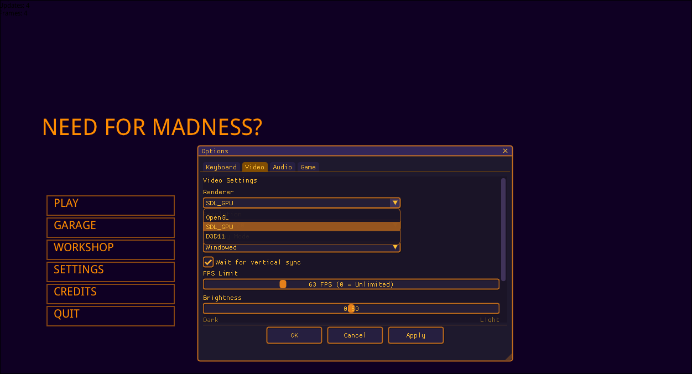
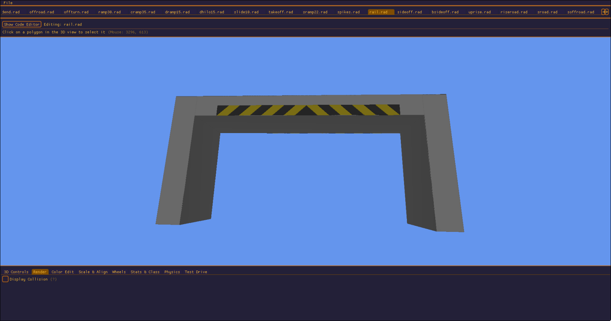
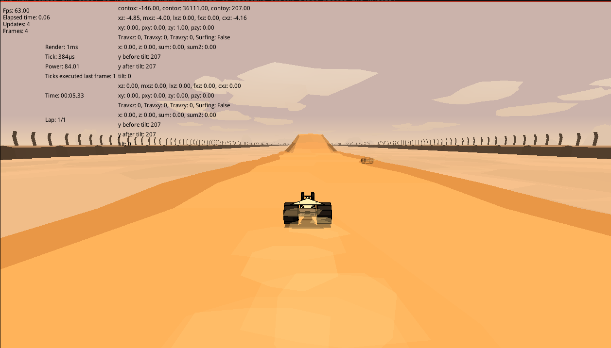

# NFM-World
Need For Madness World

Join the Discord: https://discord.gg/dWYbcCg2r8

NFM World is a spiritual progression of the Need for Madness!? series of games. It is an attempt by the community to bring the game forwards in the modern era, while honouring and respecting its roots.

NFM World can be considered a continuation of the NFM Origins project spearheaded by Phyrexian.

As part of this goal, NFM World attempts to fulfill the following key goals:
 - Improve the gameplay feel of NFM, bring it from 21fps to targeting ~60tps with an uncapped and configurable framerate.
 - Use modern graphics APIs (OpenGL, Vulkan etc.) and move away from the custom rendering implementation of previous games.
 - Provide a modern multiplayer system with support for more features, a stronger anticheat and moderation system, and better regional servers.
 - Elevate the experience of creating new stages and cars, as well as opening the doors to creating custom stage pieces and wheels.
 - Make time trials a first-class feature, integrating splits, leaderboards, demos ("ghosts"), best laps, and server-side anti-cheat.

A big thank you to everyone who has helped develop and test NFM World during its infancy.

